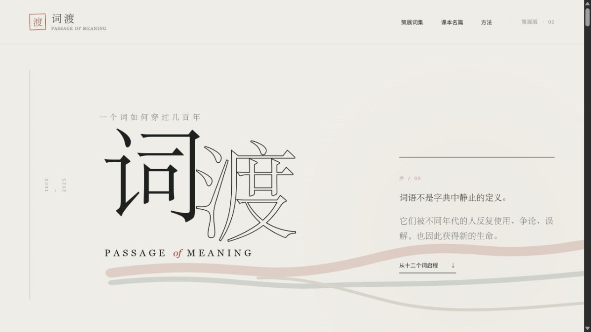
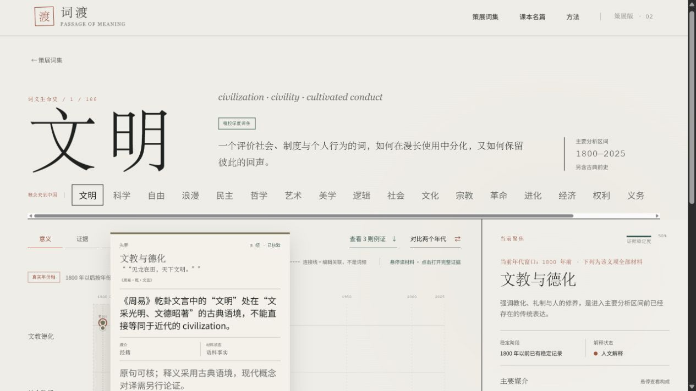

# 词渡 · Passage of Meaning

一个观察中文词语如何穿过时代的互动人文项目。

词典擅长列出释义，词渡更关心这些释义在什么时候出现、通过什么文本传播，以及新旧含义如何并存。时间轴上的节点来自带年份的真实材料，用户可以查看原句、出处、语境、证据等级与核验状态。



## 项目内容

- 188 个策展词条，分布在 10 条语义研究路线中
- 468 个真实材料时间节点，覆盖先秦至 2025 年
- “意义、证据、媒介、稳定度、争议”五种观察视角
- 12 篇中小学课本名篇，可从诗文中的高亮词进入词史
- A / B / C 三级证据说明与完整材料阅读器
- 用户例句暂存入口

时间轴只显示带真实年份、原句和来源的材料。没有合格材料的义项会明确留白；材料年份也不等于词义首次出现的年份。



## AI 与人工复核

项目使用 AI 协助界面实现、词表扩展和语料候选检索。词义归类、敏感语境排除、年份核对与材料取舍仍由人工逐条检查。研究脚本与候选选择记录保留在 `research/` 目录中。

## 本地运行

```bash
pnpm install
pnpm dev
```

生产构建：

```bash
pnpm build
```

设计规范见 `design-system/词渡-passage-of-meaning/MASTER.md`。
